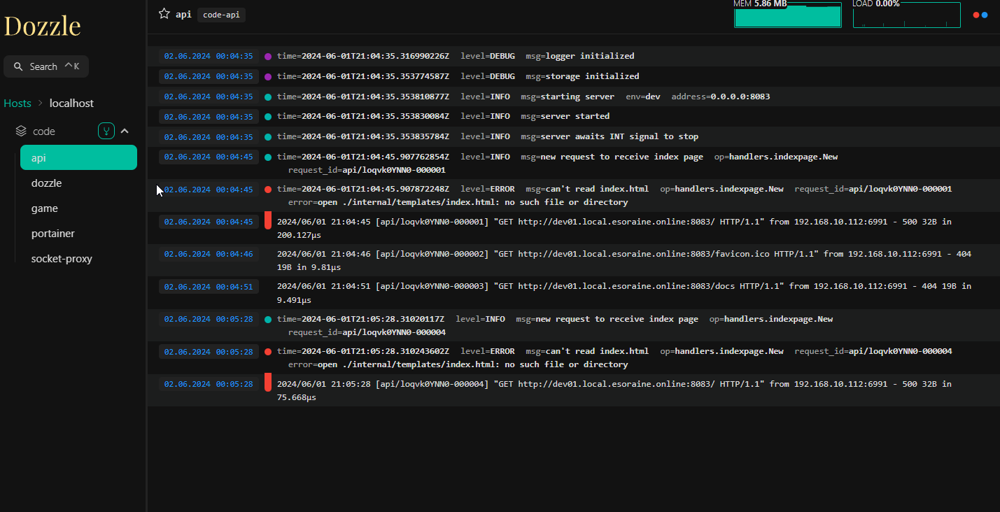
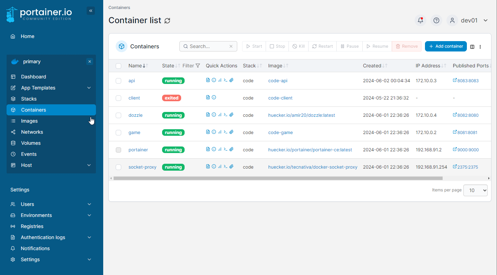

1. Переименовать .env.example в .env
2. Поменять пути к корневой папке с проектом
3. Кто не хочет через докер, просто запускайте с соответствующей папки 

```bash
npm run dev
or
что там у вас на go )
```

```bash
cd game
npm install
```


```bash
cd ..
docker compose up --build -d    
```


0.0.0.0:8081 - frontend (https://dev01-client.esoraine.online)

0.0.0.0:8082 - backend (https://dev01-api.esoraine.online)

0.0.0.0:8082 - dozzle (Просмотр логов контейнеров)



0.0.0.0:9000 - portainer (Работа с контейнерами)
