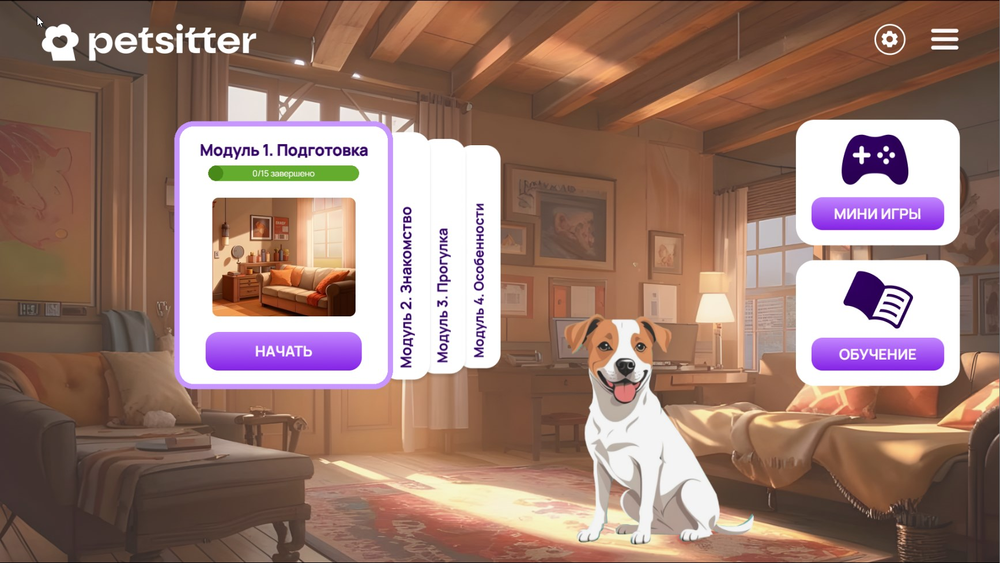

# Pet-Sitters игра
Геймифицированное обучение и тестирование кандидатов в кэт и дог ситтеры.

<h2 align="center">
<p align="center">


</p>
</h2>

<p align="center">
</p>

### О проекте:
Проект представляет собой современную многокомпонентную систему, направленную на создание интерактивного игрового опыта для пользователей.

1. Серверная часть:

Реализована на языке Go, что позволяет обеспечить высокую производительность и надежность.
Для хранения данных игровых сессий и результатов тестирования игроков используется база данных MongoDB.

2. Клиентская часть:

Построена на фреймворке React, что обеспечивает гибкость и удобство разработки пользовательского интерфейса.
Для создания 2D игры, доступной как на десктопных, так и на мобильных устройствах, используется библиотека Phaser.

3. Контейнеризация:

Все компоненты приложения развернуты в Docker контейнерах. Это решение позволяет упростить процессы развертывания и обслуживания, а также гарантирует консистентность среды выполнения.

### Дополнительно:
Для повышения удобства и эффективности разработки добавлены следующие контейнеры:

- **Portainer**: Web-интерфейс для управления Docker контейнерами, позволяющий осуществлять мониторинг и управление контейнерами с помощью графического интерфейса.
- **Dozzle**: Инструмент для мониторинга логов Docker контейнеров в режиме реального времени, упрощающий отладку и анализ работы системы.
- **Mongo Express**: Web-интерфейс для работы с базой данных MongoDB, обеспечивающий удобный доступ и управление данными.

### Установка:

1. Склонируйте репозиторий

```bash
git clone https://github.com/SecretTeam-17/Complex.git
```

2. Переименовать .env.example в .env
3. Поменять пути к корневой папке с проектом
4. Перейдите в папку с frontend частью (game) и установите зависимости

```bash
npm install
```

5. Запустите Docker compose файл 
```bash
docker compose up --build -d      
```

#### Адреса контейнеров:
0.0.0.0:8081 - frontend<br>
0.0.0.0:8082 - dozzle<br>
0.0.0.0:8083 - backend<br>
0.0.0.0:8085 - mongo express<br>
0.0.0.0:9000 - portainer<br>
